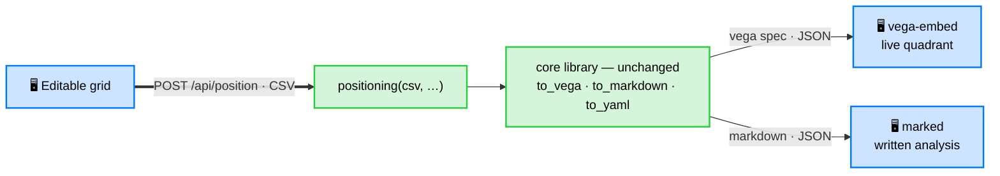

# GUI — feasibility investigation (`dev-gui` branch)

> Status: **working proof-of-concept**, not a shipped feature. This branch explores
> whether Standpoint deserves a browser GUI that goes *from table editing to a
> quadrant image and written comments*, and what it would cost to build well.


## The opportunity

Standpoint's core is a one-command pipeline, but its audience (marketers, analysts,
PMs, researchers) does not live in a terminal. The CLI is perfect for scripting and
CI; a GUI would open the same engine to people who just want to *type a table and get
a map*. The whole value proposition — derived, labelled, written positioning in one
step — is exactly the kind of thing a small local web app makes approachable.

Crucially, the figure is a **Vega-Lite spec**, so the browser can render it live with
`vega-embed` — no server-side image round-trip for display, full interactivity
(tooltips, pan, PNG/SVG export from the built-in menu) for free. That makes the GUI
unusually cheap to build on top of the existing library.

## What the proof-of-concept already does

Run it (`standpoint-gui`) and, entirely on `localhost`:

1. **Edit a table** — an editable grid seeded with an example: add/remove options
   (rows) and criteria (columns), rename headers, edit cells, mark a column
   *lower-is-better* with the `↓` toggle, and pick the reference (top-right) option.
   Or **upload a CSV / XLSX** file (Excel is read server-side via pandas + openpyxl)
   and **download** the edited table as CSV or XLSX.
2. **Generate** — the grid is serialized to CSV and POSTed to `/api/position`, which
   runs the real `positioning()` pipeline.
3. **See the quadrant** — the returned Vega-Lite spec is rendered live, with a
   transparent/white background toggle and the vega-embed export menu (PNG/SVG).
4. **Read the analysis** — the Markdown interpretation is rendered beside the map;
   the YAML and Markdown are downloadable.

Optionally tick *"name axes + write analysis with the local model"* to get
LLM-named poles and the written narrative (slower); unticked, it is instant and
deterministic.

## Architecture

Deliberately thin — the library stays the single source of truth:

Blue nodes run in the **browser** (one HTML page, no build step); green nodes run in
the **FastAPI** server on top of the unchanged core library.



(Tailwind + vega-embed + marked load from a CDN; the core library never imports the
web layer.)

- `standpoint/api.py` — FastAPI app: `GET /gui`, `GET /api/example`,
  `POST /api/position`, `GET /` → `/gui`. Launcher `main_gui()` (`standpoint-gui`).
- `standpoint/webgui.py` — the whole page as one self-contained HTML string
  (vanilla JS + Tailwind + vega-embed + marked, all via CDN — no framework, no npm).
- `pyproject.toml` — a `gui` extra (`fastapi`, `uvicorn`) and the `standpoint-gui`
  script. The core library and the two CLIs import none of it.

## Run it

```bash
pip install -e ".[gui]"
standpoint-gui                     # → http://localhost:8000/gui
# or: uvicorn standpoint.api:app --reload
```

Local-first: the server binds to `127.0.0.1` only, so the table never leaves the
machine (the LLM, when enabled, is the same local Ollama the CLI uses).

## Honest assessment / limitations

- **PoC polish.** Column headers truncate at a fixed width; the two-panel layout
  pushes the analysis below the map on narrow screens; no drag-to-reorder yet. All
  are straightforward front-end work.
- **Tests.** `tests/test_gui.py` covers the endpoints (page served, example, position
  round-trip, both 400 paths, CSV+XLSX upload, XLSX download); it runs only when the
  `gui` extra is installed, so the default suite is unaffected.
- **Synchronous requests.** With the model on, `/api/position` blocks for ~10–25 s.
  Fine for one user on localhost; a streaming or two-step (spec first, narrative
  after) response would feel better.
- **Scope guard.** Per the project's direction, the GUI stays an *optional extra* on
  its own branch; it must never become a dependency of the library or the CLIs.

## Roadmap (if we pursue it)

1. CSV / XLSX upload + download **done**; next: Markdown paste and drag-to-reorder.
2. Two-step response: render the map immediately, stream the narrative when ready.
3. `--reference`, `--top`/`--right` overrides and `--model` surfaced in the UI.
4. A `gui` smoke test + a CI job that at least imports the app.
5. A short screencast in the README, and a decision on whether to merge to `main`
   as a supported surface or keep it as a labelled experiment.

## Recommendation

The PoC shows the GUI is **cheap and natural** to build on the existing engine —
most of the work is done by `positioning()` and Vega-Lite. It meaningfully widens
the audience for little added surface (two files + one optional extra). Worth
pursuing to a v1 behind the `gui` extra; keep it off the core's dependency path.
